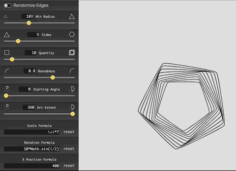
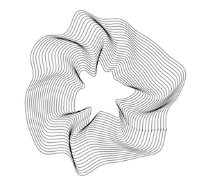
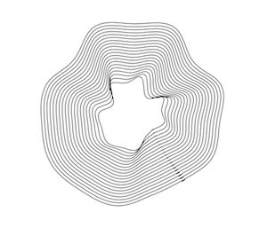
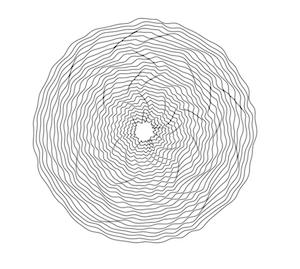
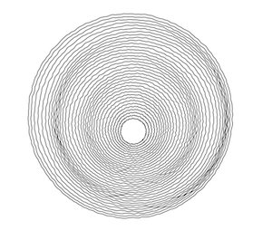

# Rad Lines

Rad Lines: Create Plotter-Friendly SVG Patterns Instantly

Design unique, plotter-ready SVG patterns with customizable shapes, rotation formulas, and more. Instantly download your creations for use with CNC, laser cutters, or drawing robots.

# Interface demo



# Samples

Here are some samples of artworks created with this tool:






# Support Creator

If you find this tool useful, I'd like to encourage you to support my efforts by buying me coffee or giving any other amount on these platforms:

- Patreon: https://www.patreon.com/msurguy
- Open Collective: https://opencollective.com/drawingbots-community
- Ko-Fi: https://ko-fi.com/msurguy

## Build Setup

``` bash
# install dependencies
yarn install

# serve with hot reload
yarn run dev

# build for production with minification
yarn run build
```
